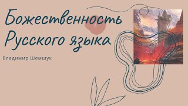

# Божественность Русского языка

*17 мар.*

# Божественность Русского языка

* [Шемшук В.А.](https://www.shemshuk.net/profile/59c7cbbb-c0bc-4f74-923d-e100c1f1b8e3/profile)
* 17 авг. 2020 г.
* 1 мин. чтения

Обновлено: 2 нояб. 2020 г.

Фильм об открытости старой Русской грамматики, открытого словообразования, открытого буквообразования, которые приводили к наращиванию божественности в Русском языке, превращая его в Божественную силу

* [Видео](https://www.shemshuk.net/blog/categories/d0-92-d0-b8-d0-b4-d0-b5-d0-be)

1083

1 083 просмотра

Пост не отмечен как понравившийся